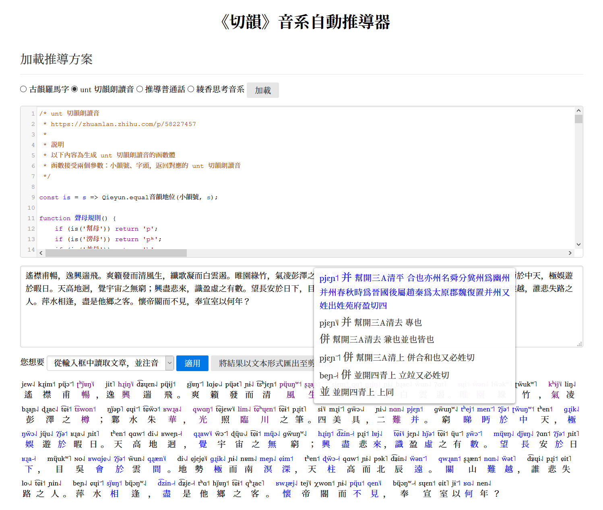

# 《切韻》音系自動推導器

<https://nk2028.shn.hk/qieyun-autoderiver/>

## 介紹

《切韻》音系自動推導器是為了利用《切韻》音系資料進行自動推導而設計的一個線上工具。它解決了以下三類問題：

1. 由《切韻》音系資料，根據轉換規則生成《切韻》音系的擬音或轉寫
1. 由《切韻》音系資料，根據演化規律生成後世的漢字音系
1. 由《切韻》音系資料，根據對應關係生成人造漢字音系

為了使用的簡便，《切韻》音系自動推導器提供以下兩種功能：

1. 從輸入框中讀取文章，並注音
1. 生成詞典，從而導入 Rime 輸入法（暫未實現）

《切韻》音系自動推導器默認提供以下推導實例：

1. **《切韻》音系擬音或轉寫類**：古韻羅馬字、白一平轉寫、unt 切韻朗讀音
1. **後世的漢字音系類**：推導普通話、推導廣州音（暫未實現）
1. **人造漢字音系**：綾香思考用語

用户還可以自行編寫代碼，增加新的推導實例。

《切韻》音系自動推導器具備以下特性：

1. 簡體字、異體字轉換
1. 根據釋義手動選擇多音字
1. 預測多音字最可能的發音（暫未實現）

## License

Source code is distributed under MIT license.

## Demo

